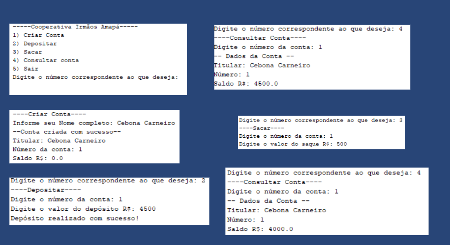

<html lang="pt-br">
<h1 align="center"> Cooperativa Irmaõs Amapá </h1>

Classroom activity 

  <a href="#tec">Technologies</a>&nbsp;&nbsp;&nbsp;|&nbsp;&nbsp;&nbsp;
  <a href="#pro">Projeto</a>

 

  

## 
Technologies

Desenvolvido com:

- Java
- Canva
- Ferramenta de captura do windows

## 
Projeto

Atividade de sala de aula de um programa que simula uma cooperativa de crédito. Esse programa não possui interface gráfica. O Objetivo foi consolidar o conceito de classes em Java.

---
